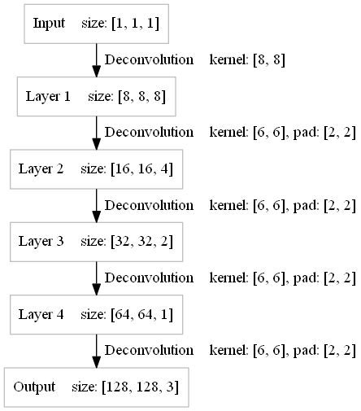
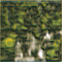

A Simple Example To Learn Deconvolution And Locally Connected Deconvolution
====

Deconvolution means the reverse operation of convolution here, not transpose convolution

In this example, we will test two networks(Model A and Model B), Model B is similar to Model A except that Model B uses locally connected deconvolution

<b>Model A</b> 

<b>Model B</b> 

To make things as simple as possible, we use only the following two samples to train the network
<table><tr><td></td><td></td></tr></table>
If input is "0", output will be the photo of girl, if input is "1", output will be the photo of sunflower

After training, the network will remember the two photos

The question is, what will the output be if input is "0.2", "0.5" or "0.8"?

Why Model A and Model B have different outputs?

If f(0) = the photo of girl, f(1) = the photo of sunflower 
Model A thinks the following picture is f(0.5):

Model B tends not to forget anything and is hard to remember anything as well 
The following picture is outputed by Model B:

