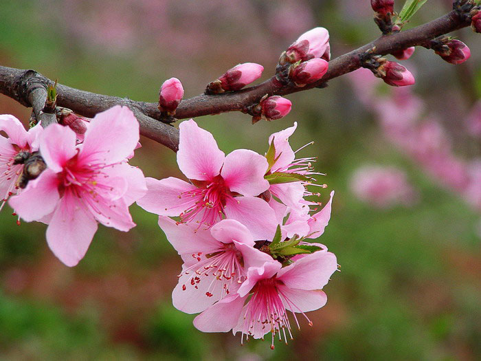
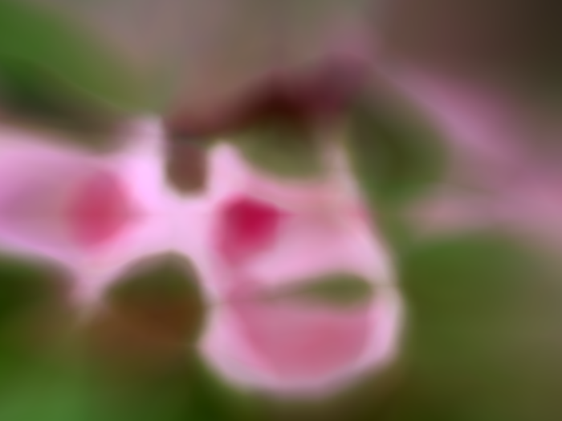
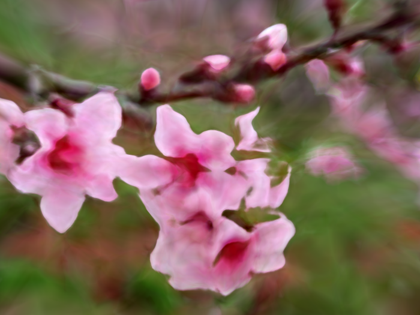

Training An Artificial Neural Network To Sketch From Nature
====

An artificial neural network can help artists design artworks. This example shows one method

First, select a nature image to sketch

Then, define a model for the artificial neural network

Each time we feed the artificial neural network with one randomly selected pixel, take the coordinate(x, y) of each pixel as input and 
the color(r, g, b) of each pixel as output

The artificial neural network will "sketch" gradually

After about a few minutes, you will get the following picture

After about 2 hours, you will get the following picture

 

Go chess player can learn from AlphaGo, artists can learn to draw from machine too!
