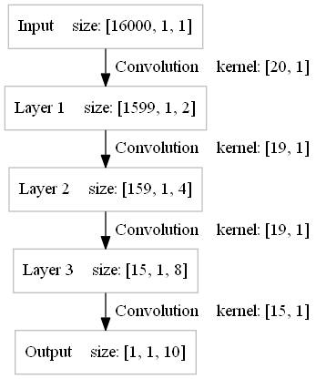

The "Hello World" Example Of Audio Recognition Using Raw Wav Data As Input 
====

Although using MFCC, FBANK or spectrogram as input may improve test accurary obviously, for a "Hello World" example, we remove all the unnecessary part so you do not have to know cepstrum, fourier transform...

We use WAVE audio files of people saying ten different words('yes', 'no', 'up', 'down', 'left', 'right', 'on', 'off', 'stop', 'go') from [Speech Commands dataset](https://storage.cloud.google.com/download.tensorflow.org/data/speech_commands_v0.01.tar.gz), among all the WAVE audio files randomly select 90% for train samples and the rest for test samples. 

Each WAVE audio file is one second long with a frame rate of 16000, so the model can be defined as follow:

 

