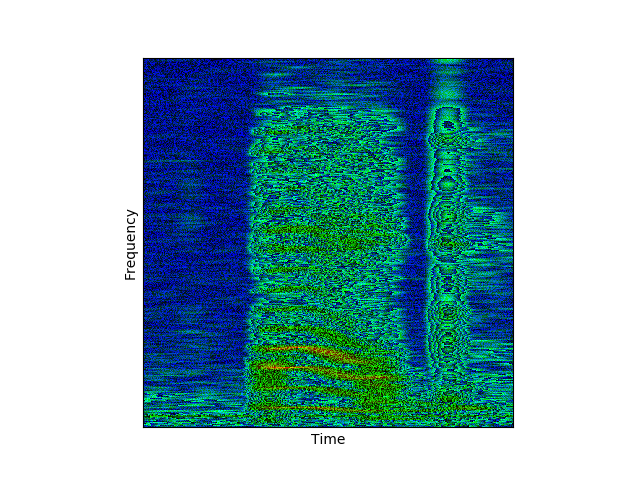
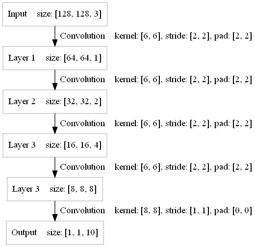

Audio Recognition Using Spectrogram As Input 
====

By using spectrogram, we can simply treat audio recognition as image recognition, so all the technologies used at image recognition can be used at audio recognition as well

This example uses the same samples as [speech_commands](../speech_commands/), that is wave audio files of people saying ten different words('yes', 'no', 'up', 'down', 'left', 'right', 'on', 'off', 'stop', 'go') from [Speech Commands dataset](https://storage.cloud.google.com/download.tensorflow.org/data/speech_commands_v0.01.tar.gz)

First, transform the original audio files into spectrograms, we use the following python code to do the task:
>	
	X_SIZE = 16000
	IMG_SIZE = 128

	def spectrogram(filepath):
		framerate, wav_data = wavfile.read(filepath)

		window_length = 512
		window_shift = 121

		if len(wav_data) > X_SIZE:
			wav_data = wav_data[:X_SIZE]

		X = np.zeros(X_SIZE).astype('float32')
		X[:len(wav_data)] += wav_data
		spec = np.zeros((IMG_SIZE, IMG_SIZE)).astype('float32')

		for i in range(IMG_SIZE):
			start = i * window_shift
			end = start + window_length
			sig = np.abs(np.fft.rfft(X[start:end] * np.hanning(window_length)))
			spec[:,i] = (sig[1:IMG_SIZE + 1])[::-1]

		spec = (spec-spec.min())/(spec.max()-spec.min())
		spec = np.log10((spec * 100 + 0.01))
		spec = (spec-spec.min())/(spec.max()-spec.min()) - 0.5

		return spec

For example, the spectrogram for [test.wav](files/test.wav) is:

To reduce the amount of computation, we limit the size of spectrogram to 128×128, so the model can be defined as follow:

 

Run this model, you will get a test accuracy around 93% after 15 epochs

Reference
----
* [Simple Audio Recognition](https://www.tensorflow.org/versions/master/tutorials/audio_recognition)

